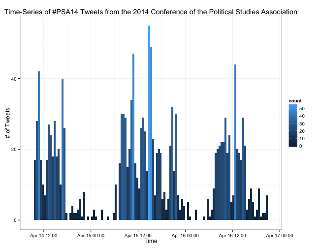
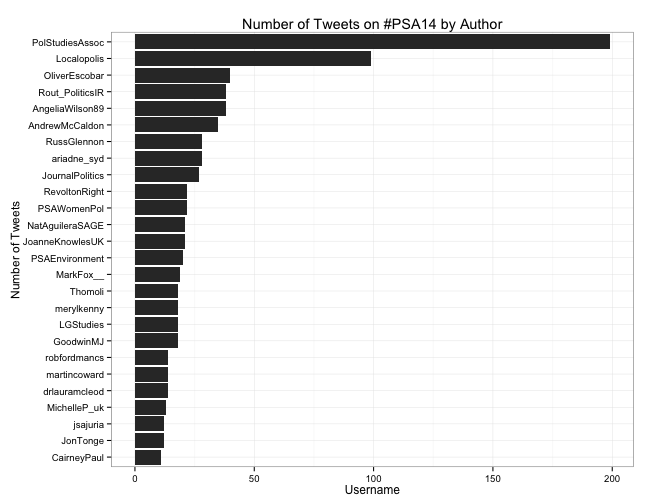
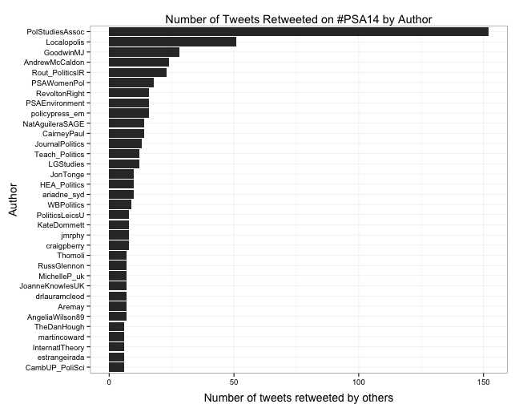
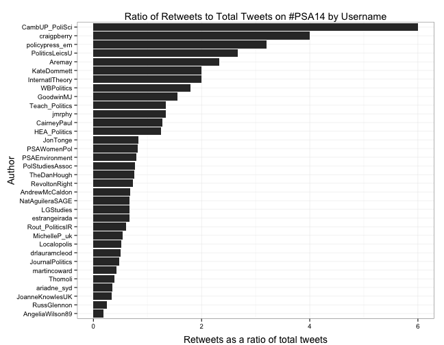
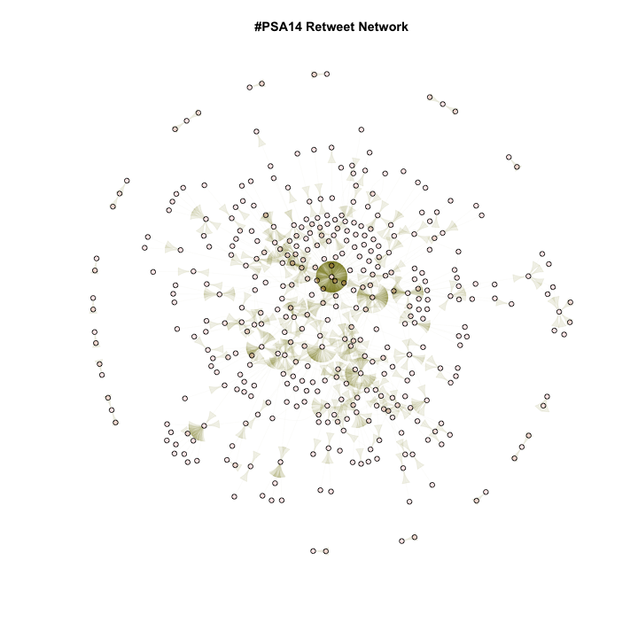
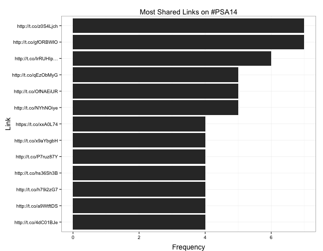
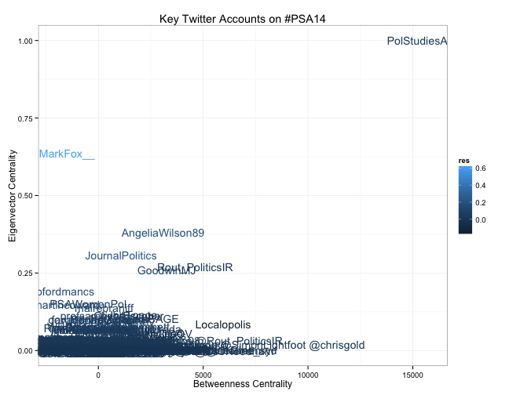
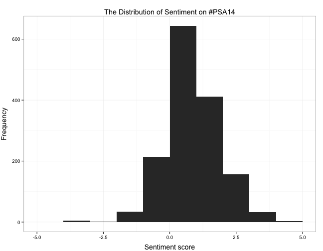
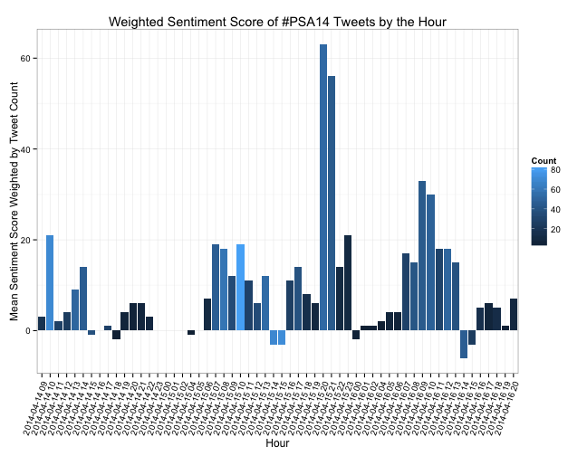
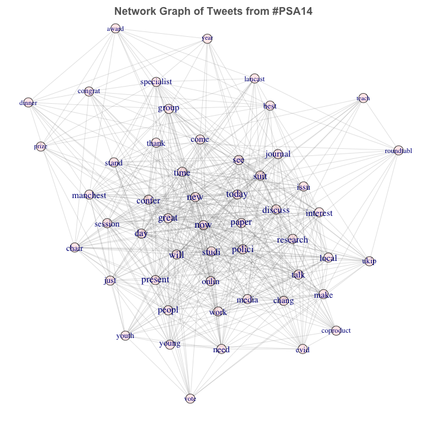

# Reviewing the 2014 Political Studies Conference with Twitter Data

What were the most talked-about issues during the 2014 Political Studies Conference last week? How are those issues connected? How many attendees used Twitter? How was that communication network structured? How did sentiment change over time throughout the conference?

To get some leverage on questions such as these, below I analyze all the tweets containing the hashtag #PSA14 between Monday April 14 (roughly 9 a.m.) until Wednesday April 16th (roughly 8 p.m.). The Twitter API only provides 1500 tweets per call but, conveniently, that allows us to analyze every tweet during this period. As with all social media data, this data is almost certainly not representative of the whole population of attendees. Needless to say, these analyses do not describe the conference as such, but only that portion of the conference which took place on Twitter!

## The dynamics of conference tweeting

No big surprises here. Conference tweeting typically peeked in the middle of each day, and the middle day of the conference saw the most Twitter activity. Each bar represents a 30-minute interval.

## Who tweeted the most?

## Who received the most retweets?

## Who received the most retweets, as a ratio of total tweets?

Retweets are an indicator of influence, but people who tweet frequently will be retweeted more than infrequent tweeters, so a better measure of influence is retweeted tweets as a ratio of total tweets.

## What was the network structure of retweets?

Who retweeted who, visualized as a network.

## Centrality and Brokerage

Number of retweets is a good first look at influence, but not all retweets are equal in network terms. A tweet which is retweeted from someone who is also often retweeted is more influential than receiving retweet from someone who is rarely retweeted. This is what is captured by the network concept of "eigenvector centrality." On the other hand, there might be nodes in the network which are not necessarily retweeted very frequently or by influential nodes, but are important nodes because they connect many other nodes who otherwise would not be connected. "Betweenness centrality" captures the degree to which a node sits on the shortest path between all other actors. Typically, eignevector centrality and between centrality will be positively correlated, and this is a straightforward indication of the power of that node in the network. But nodes off the diagonal represent other kinds of power. Nodes with high eigenvector centrality but low betweenness centrality are relatively powerful nodes but relatively outside the community. Nodes with high betweenness centrality but low eigenvector centrality are "brokers" who are not high-visibility but are powerful because a relatively high number of nodes go through that node to stay connected.

Thus, this graph helps us identify interesting nodes in the conference network, which we would not notice by just looking at who tweeted the most and who was retweeted the most. The businessman and journalist @MarkFox__ did not tweet much on #PSA14, and he's a relative outsider to the network, but when he tweeted he was disproportionately retweeted by the most influential nodes within the network. @chrisgold was not retweeted very frequently by very influential nodes, but a relatively high number of nodes are connected to the rest of the network through him. 

Note: That some of the usernames here have an "@" in front but some of them don't suggests that there might have been a small error in some of the text-processing of usernames. I would fix this, if it were any more important than a blog post! It doesn't seem to be much of a problem, as everything else is very consistent with what we would expect.

## How positive/negative was the conference tweeting?

I used the Hu and Lui sentiment lexicons to do a basic "sentiment analysis" of the conference tweets. A sentiment lexicon is basically one large list of negative words and one large list of postive words. It sounds naive but it works, as evidenced by how much this is used in marketing. The sentiment of a tweet is simply the number of postive words minus the number of negative words.

## How did the overall sentiment change over the course of the day, on average?

## How did the overall sentiment change throughout the conference, by the hour?

## What were the most frequent terms tweeted, and how were they associated?

Below are the 50 terms which appear most frequently throughout the 1500 tweets (I use stems of words rather than whole words to avoid redundancy, as is conventional in text-mining). The first several are terms related to the conference, but then several substantive political issues emerge. Some notable themes include: youth politics, UKIP, engagement and participation, and media.

====================
Frequency    Term   
--------------------
119          new    
95          great   
94           now    
84          group   
83           suit   
77         research 
76          paper   
73           day    
72         journal  
71          today   
66         present  
65          teach   
64          peopl   
61          polici  
60          prize   
58          local   
57         manchest 
57           time   
55          chair   
55           ukip   
55           will   
53          award   
53          young   
52          confer  
50          dinner  
50         discuss  
48         interest 
48           vote   
47        specialist
46          thank   
45           need   
45           year   
45          youth   
44           issu   
44          studi   
43         congrat  
43           make   
43           talk   
42           best   
42           come   
42          media   
42          onlin   
42           work   
41           just   
41        roundtabl 
41         session  
40        coproduct 
40           see    
39          chang   
38           evid   
--------------------

## How were the main themes connected?

In other words, how did the most-tweeted terms cluster in the entire network of terms discussed? To understand this better, we can visualize the entire vocabulary of the 1500 tweets as a network. Every word which appears in a tweet with another word, represents a non-directional connection. Below is a graph of this network with the most central nodes highlighted and labeled.

This post revealed the who, what, and when of how the 2014 Political Studies Conference took to Twitter this year. Feel free to explore the raw dataset, or use my code to analyze the data yourself.
